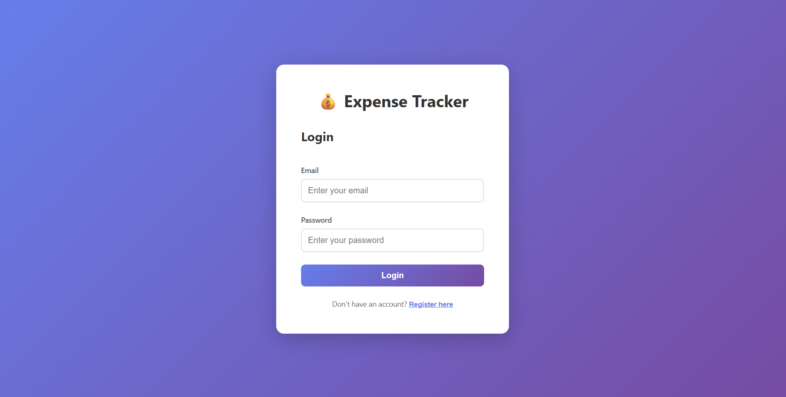
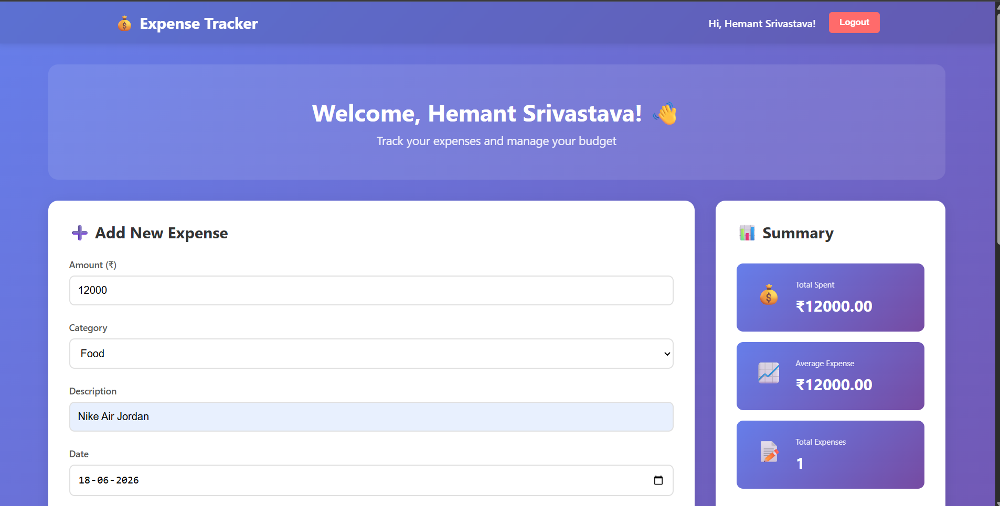

# 💰 Expense Tracker

A full-stack MERN (MongoDB, Express, React, Node.js) expense tracking application with JWT authentication, real-time stats, and category-based filtering.

---

## 🚀 Features

- **Authentication** — Register and login with JWT-based auth
- **Add Expenses** — Add expenses with amount, category, description, and date
- **Edit & Delete** — Update or remove existing expenses
- **Filter Expenses** — Filter by category and date range
- **Statistics** — View total spent, average expense, and category breakdown
- **Pie Chart** — Visual breakdown of spending by category
- **Persistent Login** — Stay logged in after page refresh using localStorage
- **Responsive UI** — Works on mobile and desktop

---

## 🛠️ Tech Stack

### Backend
- **Node.js** — Runtime environment
- **Express.js** — Web framework
- **MongoDB** — Database
- **Mongoose** — ODM for MongoDB
- **JWT** — Authentication tokens
- **bcryptjs** — Password hashing
- **dotenv** — Environment variable management

### Frontend
- **React.js** — UI library
- **React Router DOM** — Client-side routing
- **CSS3** — Styling with gradients and animations

---

## 📁 Project Structure

```
Expense_Tracker/
├── backend/
│   ├── models/
│   │   ├── User.js
│   │   └── Expense.js
│   ├── routes/
│   │   ├── auth.js
│   │   └── expenses.js
│   ├── middleware/
│   │   └── auth.js
│   ├── .env
│   └── server.js
├── frontend/
│   ├── src/
│   │   ├── components/
│   │   │   ├── Navbar.js
│   │   │   ├── ExpenseForm.js
│   │   │   ├── ExpenseList.js
│   │   │   └── ExpenseStats.js
│   │   ├── pages/
│   │   │   ├── LoginPage.js
│   │   │   └── DashboardPage.js
│   │   ├── styles/
│   │   │   ├── App.css
│   │   │   ├── Navbar.css
│   │   │   ├── LoginPage.css
│   │   │   ├── Dashboard.css
│   │   │   ├── ExpenseForm.css
│   │   │   ├── ExpenseList.css
│   │   │   └── ExpenseStats.css
│   │   └── App.js
│   └── package.json
└── README.md
```

---

## ⚙️ Setup & Installation

### Prerequisites
- Node.js (v14+)
- MongoDB Atlas account
- Git

### 1. Clone the repository
```bash
git clone https://github.com/yourusername/expense-tracker.git
cd expense-tracker
```

### 2. Backend Setup
```bash
cd backend
npm install
```

Create a `.env` file in the `backend` folder:
```
MONGODB_URI=your_mongodb_connection_string
JWT_SECRET=your_jwt_secret_key
JWT_EXPIRE=30d
PORT=5000
NODE_ENV=development
```

Start the backend server:
```bash
npm run dev
```

### 3. Frontend Setup
```bash
cd frontend
npm install
npm start
```

---

## 🔗 API Endpoints

### Auth Routes
| Method | Endpoint | Description |
|--------|----------|-------------|
| POST | `/api/auth/register` | Register a new user |
| POST | `/api/auth/login` | Login user |

### Expense Routes (Protected)
| Method | Endpoint | Description |
|--------|----------|-------------|
| GET | `/api/expenses` | Get all expenses |
| POST | `/api/expenses` | Add new expense |
| PUT | `/api/expenses/:id` | Update expense |
| DELETE | `/api/expenses/:id` | Delete expense |
| GET | `/api/expenses/stats` | Get expense statistics |

---

## 📊 Expense Categories

- 🍔 Food
- ✈️ Travel
- 🎬 Entertainment
- 🛍️ Shopping
- 📄 Bills
- 🏥 Healthcare
- 📌 Others

---

## 🔐 Environment Variables

| Variable | Description |
|----------|-------------|
| `MONGODB_URI` | MongoDB connection string |
| `JWT_SECRET` | Secret key for JWT tokens |
| `JWT_EXPIRE` | Token expiry duration (e.g. 30d) |
| `PORT` | Server port (default: 5000) |
| `NODE_ENV` | Environment (development/production) |

---

## 📸 Screenshots

### Login Page


### Dashboard


---

## 👨‍💻 Author

**Hemant Srivastava**
- GitHub: [@hemant3009](https://github.com/hemant3009)

---

## 📄 License

This project is open source and available under the [MIT License](LICENSE).